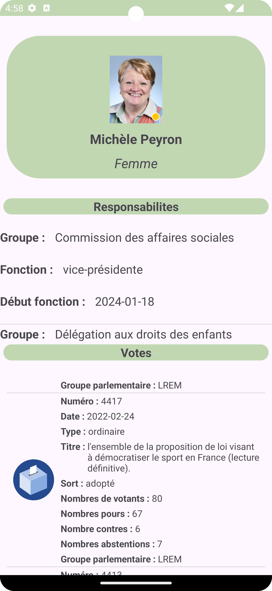

# Nos députés - Android  

Le but de ce projet est de pouvoir retrouvés les députés ainsi que plusieurs informations les concernants.  
Notament les votes  des députés sur différents projets de loi.

## API utilisées
* [Liste des parlementaires](https://www.nosdeputes.fr/)
* [Scrutins et votes des parlementaires](https://github.com/regardscitoyens/nosdeputes.fr/blob/master/doc/api.md#scrutins-et-votes-des-parlementaires) 

## Utilisation et Installation

Vous pouvez 
[télécharger l'application en apk juste ici.](https://github.com/Skuskusku13/nosdeputes-android/raw/main/app/build/outputs/apk/debug/app-debug.apk)

### Recherche

Il suffit de cliquer sur la loupe afin de renseigner un nom, un prénom, un code postal ou bien une ville.  

 

### Résulats

 

### Responsabilitées && Votes

Sur cette page vous avez les détails du député.    
Les *Responsabilités* ainsi que les *Votes* sont une listview scrollable verticalement.     
 

  
